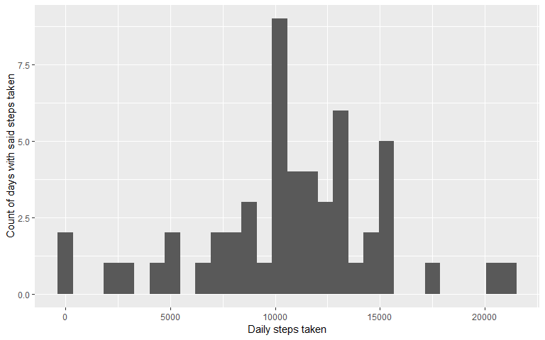
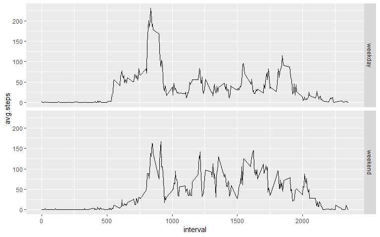
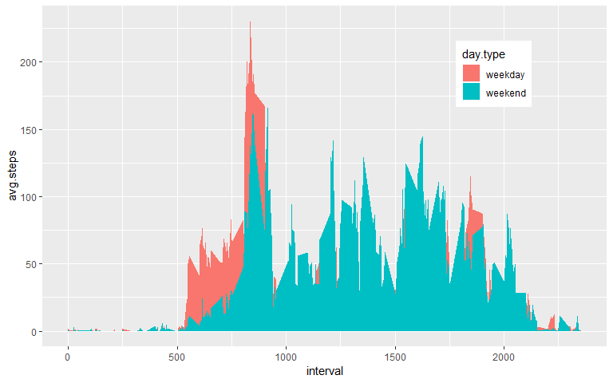

Loading and preprocessing the data
----------------------------------

I expect this program to be run from the repository <https://github.com/Mathieu-MICHEL/RepData_PeerAssessment1>, containing the data as a zip file **"activity.zip"**.

And I like to store it as a tibble, from the tidyverse (check it out <https://www.tidyverse.org/>)

``` r
        data <- as.tibble(read.csv(unzip("activity.zip")))   
        data
```

    ## # A tibble: 17,568 x 3
    ##    steps date       interval
    ##    <int> <fct>         <int>
    ##  1    NA 2012-10-01        0
    ##  2    NA 2012-10-01        5
    ##  3    NA 2012-10-01       10
    ##  4    NA 2012-10-01       15
    ##  5    NA 2012-10-01       20
    ##  6    NA 2012-10-01       25
    ##  7    NA 2012-10-01       30
    ##  8    NA 2012-10-01       35
    ##  9    NA 2012-10-01       40
    ## 10    NA 2012-10-01       45
    ## # ... with 17,558 more rows

I'm somewhat happy with this dataset. I prefer to have the date in a different format, as it is a factor at first. I choose to replace it by a date format:

``` r
        data %<>% mutate(date = as.Date(date))  
```

What is mean total number of steps taken per day?
-------------------------------------------------

To answer this question, I need to compute the total steps taken date by date:

``` r
        data.by.date <- aggregate(data$steps, by = list(data$date), sum)
        
        names(data.by.date) <- c("date","daily.steps")

        data.mean <- round(mean(data.by.date$daily.steps, na.rm = T),
                           digit = 2)
        
        data.median <- median(data.by.date$daily.steps, na.rm = T)
```

From there, I get directly the **mean: 10766.19 and median: 10765**.

Here I am interested in the distribution of the variable "Total number of steps taken per day". I create the histogram, that is the repartition of days by number of steps during the day. To proceed, I use ggplot2 syntax as follow:

``` r
        ggplot(data.by.date,
               aes(x=daily.steps)) + 
                geom_histogram() +
                xlab("Daily steps taken") +
                ylab("Count of days with said steps taken")
```

    ## `stat_bin()` using `bins = 30`. Pick better value with `binwidth`.

    ## Warning: Removed 8 rows containing non-finite values (stat_bin).



What is the average daily activity pattern?
-------------------------------------------

For that, I need the same type of computation as earlier but along the interval dimension:

``` r
        data.by.interval <- aggregate(data$steps, 
                                      by = list(data$interval), 
                                      mean,
                                      na.rm=TRUE, 
                                      na.action=NULL)
        
        names(data.by.interval) <- c("interval","avg.steps")
        
        ggplot(data.by.interval,
               aes(x=interval, y=avg.steps)) + 
                geom_line() +
geom_vline(xintercept=
data.by.interval[data.by.interval$avg.steps==max(data.by.interval$avg.steps),]$interval, color = "red") # I add a red line where the maximum value is reached
```


So I find the **interval 835**, as the one for which the maximum steps are taken (and that would be 206 steps), on average accross all days observed.

Imputing missing values
-----------------------

About missing values, I can easily compute:

``` r
        summary(data$steps)
```

    ##    Min. 1st Qu.  Median    Mean 3rd Qu.    Max.    NA's 
    ##    0.00    0.00    0.00   37.38   12.00  806.00    2304

Which gives me **2304 missing values**.

Here, the idea is that means of steps per interval have already been computed and that it seems realistic to use the mean per interval to fill missing values (instead of the mean per day: I walk on a relatively constant daily pattern myself, while behaving very differently at 4.30 am and 5.30pm, somewhat independantly of the day).

I will replace NAs by the **mean for the corresponding interval** accross available observations:

``` r
        data.NoNA <- left_join(data,data.by.interval, by = "interval")
        
        for (i in 1:length(data.NoNA$steps)) {
                if (is.na(data.NoNA$steps[i])) {
                        data.NoNA$steps[i] <- data.NoNA$avg.steps[i]}
                
        }
        
        data.NoNA <- data.NoNA[1:3]
```

I have my new completed dataset **data.NoNA**. I now need to reproduce the histogram steps for this new set:

``` r
        data.by.date.NoNA <- aggregate(data.NoNA$steps, 
                                       by = list(data.NoNA$date), sum)
        names(data.by.date.NoNA) <- c("date","daily.steps")

        data.NoNA.mean <- round(mean(data.by.date.NoNA$daily.steps, na.rm = T),
                           digit = 2)
        data.NoNA.median <- median(data.by.date.NoNA$daily.steps, na.rm = T)

        ggplot(data.by.date.NoNA,
               aes(x=daily.steps)) + 
                geom_histogram() +
                xlab("Daily steps taken") +
                ylab("Count of days with said steps taken")
```

    ## `stat_bin()` using `bins = 30`. Pick better value with `binwidth`.


This change alters a bit the shape of the distribution, somewhat sharper now. Mean and median are affected as follow:

        * mean = 10766.19, no change,
        
        * median = 10766.19, slight increase due to completed observations.

Are there differences in activity patterns between weekdays and weekends?
-------------------------------------------------------------------------

For that, I need first to create a **day.type** variable:

``` r
        data.NoNA$day.type <- rep("weekday", length(data.NoNA$date))
        
        for (i in 1:length(data.NoNA$date)) {
                if (weekdays(data.NoNA$date[i]) %in% c("Saturday","Sunday")) {
                        data.NoNA$day.type[i] <- "weekend"}
        }
   
        data.NoNA %<>% mutate(day.type = as.factor(day.type))
```

I then compute aggregated values on two subset of the data, depending on the day.type.

``` r
        data.by.interval.NoNA.weekday <- aggregate(
                data.NoNA[data.NoNA$day.type == "weekday",]$steps, 
                by = list(data.NoNA[data.NoNA$day.type == "weekday",]$interval), 
                                           mean,
                                           na.rm=TRUE, 
                                           na.action=NULL)
        
        data.by.interval.NoNA.weekend <- aggregate(
                data.NoNA[data.NoNA$day.type == "weekend",]$steps, 
                by = list(data.NoNA[data.NoNA$day.type == "weekend",]$interval), 
                mean,
                na.rm=TRUE, 
                na.action=NULL)
        
        data.by.interval.NoNA <- left_join(data.by.interval.NoNA.weekday,
                                      data.by.interval.NoNA.weekend, 
                                      by = "Group.1")
        
        names(data.by.interval.NoNA) <- c("interval",
                                          "weekday",
                                          "weekend")
        
        data.by.interval.NoNA <- as.tibble(data.by.interval.NoNA)
        
        
        data.by.interval.NoNA <- gather(data.by.interval.NoNA, `weekday`,
                                        `weekend`,
                                        key = "day.type", 
                                        value = "avg.steps")
        
        data.by.interval.NoNA %<>% mutate(day.type = as.factor(day.type))
```

I can now plot the data:

``` r
        p <- ggplot(data.by.interval.NoNA, 
                    aes(interval, avg.steps)) +
                    geom_line()
        
        p + facet_grid(rows = vars(day.type))
```



For information, would I be interested in comparing visually the two distributions, I may want to give a look at the following representation instead:

``` r
        p <- ggplot(data.by.interval.NoNA, 
                    aes(interval, avg.steps, fill = day.type)) 
        
        p + geom_area(position = "identity") +
                theme(legend.position = c(0.8, 0.8))
```


